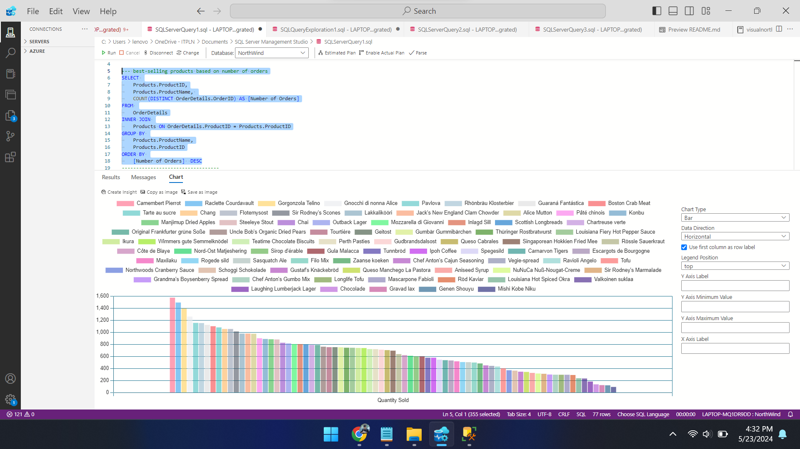
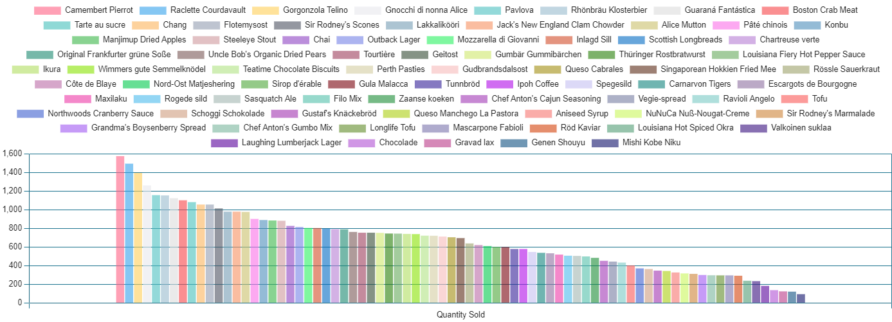
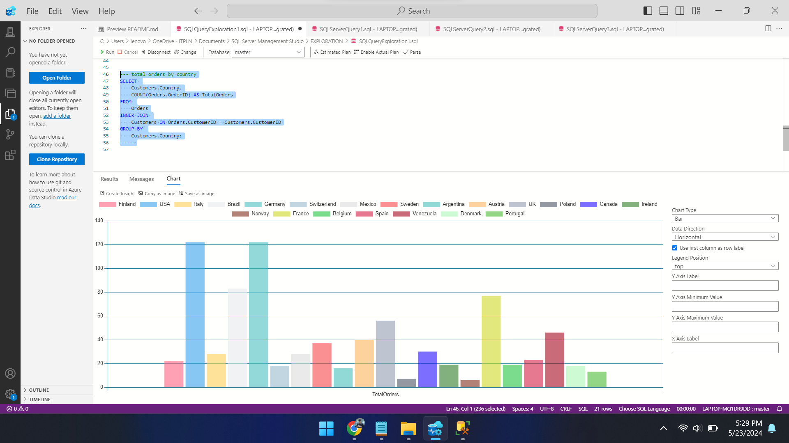
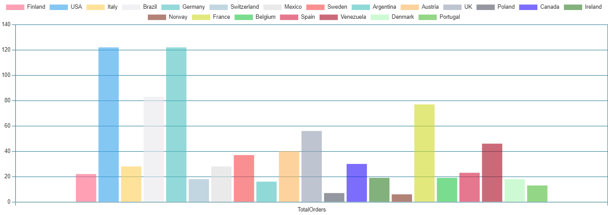

# DataExploration With Azure Data Studio

## project Overview

This project explores the Northwind database to extract insights into supplier performance, product sales, annual revenue, and geographic distribution of orders. The analysis covers six areas: calculating total quantities sold by each supplier, identifying best-selling product categories, measuring annual income, determining total orders by country, calculating revenue from each product category for a specific period, and summarizing revenue by customer country for the same period. Data will be sourced from the Suppliers, Products, Categories, Orders, Order Details, and Customers tables. Deliverables include a detailed report, visualizations, and SQL scripts used for analysis.

## Query

In this project, several SQL query methods are employed to explore data from the Northwind database. Here's a brief explanation of each query method used, emphasizing their usage of aggregate functions:
- Join: This method is used to combine data from multiple tables based on matching columns between them. It allows the merging of related data for further analysis, such as connecting product information with order details.
- Group By: This method is used to group rows of data based on specific values from one or more columns. It's useful when calculating aggregates like totals or averages for each group of data created.
- Order By: This method is used to sort the query results based on the values of one or more columns. It helps in presenting results in a structured manner and can facilitate understanding of the displayed data.
- Date Functions: Various date functions, such as extracting specific parts of a date (e.g., month, day) or performing date arithmetic, can be used to manipulate and analyze date-related data effectively. These functions help in calculating metrics like monthly revenue or year-over-year growth.
- utilizing aggregate functions


## Data Visualisation
#### identify best selling product
```
SELECT 
	Categories.CategoryName, 
	SUM(OrderDetails.Quantity) AS [number of products sold]
FROM 
	OrderDetails
INNER JOIN 
	Products ON OrderDetails.ProductID = Products.ProductID
INNER JOIN
	Categories ON Products.CategoryID = Categories.CategoryID
GROUP BY 
	Categories.CategoryName
  ```
##### image


in azure data studio there is a feature to visualize data easily, there are various kinds of charts that can be used in the example above using bar charts to visualize data so that it can be read or understood more easily

##### image bar chart


#### identify total orders by country
```
SELECT 
    Customers.Country,
    COUNT(Orders.OrderID) AS TotalOrders
FROM 
    Orders
INNER JOIN 
    Customers ON Orders.CustomerID = Customers.CustomerID
GROUP BY 
    Customers.Country;
```
#### image


##### image bar chart



